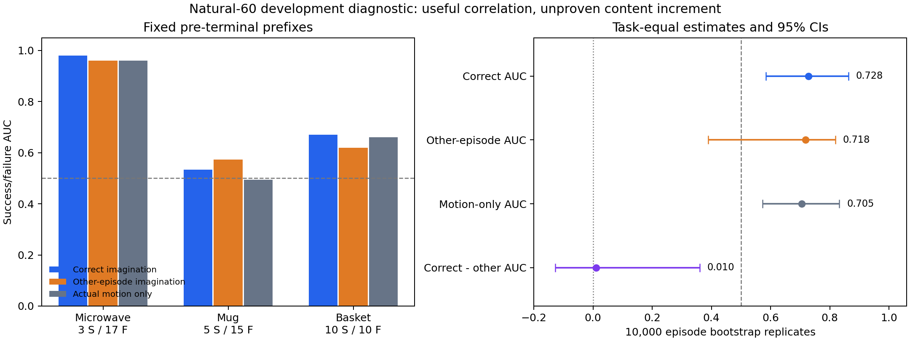

# 固定 natural-60 奖励与 AWR 传递诊断（2026-09-07）

## 决策

本轮不进入训练，不新增采集，不扩大样本。原始想象一致性具有自然成功／失败
相关性，但尚未证明**正确想象内容**优于同任务错配想象或简单运动量。
冻结协议的 AUC 门槛通过，内容增量门槛未通过；正式结论是
`inconclusive_do_not_train`，不是“证明世界模型无效”。

paired-rank 继续作为信用分配消融，不恢复为主奖励。起点 return gap 的构造保证
没有自动传递到最终 critic 下的 advantage 或 minibatch actor 权重。

## 范围与证据边界

- 固定源：`robotwin_wan_head_multitask4_smoke2_20260901` 中三个原任务的全部自然
  FastWAM rollout；微波炉 3 成功/17 失败、挂杯 5/15、篮筐 10/10，共 60 条。
- 使用 seen 指令；失败数据与当前训练来源重叠。**全部为开发诊断，不是新
  held-out，不是论文对齐 unseen 在线结果。**
- 编码前冻结协议与输入清单；2167 条 chunk，其中 2107 条完整、60 条终止尾部
  不完整。27451 张唯一图像完成 bf16 Wan2.2 VAE 单帧编码，保留 float32 头部特征。
- 主要窗口分别为前 16/13/5 个完整 chunk（384/312/120 actions），全部早于各任务
  最早成功终止。整条 episode 的结果仅描述，不用于主要门槛。
- 每个错配对照使用同任务、同 replan 的其他全部 19 条预测变化，不按 outcome
  选 donor；实际变化不变。时间对照反转六个预测偏移，固定各自首帧参考。
- 分任务、按成功／失败分层做 10000 次 episode bootstrap，seed 20260907；正确
  与错配使用同一抽样，donor 均值随抽样重算，排除所有同一目标身份的重复副本。
  CI 条件于三个固定任务及观察到的类数量，不能外推为广泛跨任务保证。
- 没有运行 FastWAM 策略推理、模拟器或优化器。仅运行冻结 VAE 编码和冻结
  actor/critic 的前向诊断。13 个原有未提交/未跟踪用户文件按字节哈希保持不变。

## 奖励内容对照

| 主要前缀 AUC | 正确想象 | 同任务同 replan 错配 | 真实潜变量运动量 | 正确减错配 |
|---|---:|---:|---:|---:|
| open_microwave | 0.9804 | 0.9608 | 0.9608 | +0.0196 |
| hanging_mug | 0.5333 | 0.5733 | 0.4933 | -0.0400 |
| place_can_basket | 0.6700 | 0.6200 | 0.6600 | +0.0500 |
| 任务等权 macro | **0.7279** | **0.7180** | **0.7047** | **+0.0099** |

Macro 的 95% CI：

- 正确想象 AUC：`[0.5833, 0.8622]`。
- 错配想象 AUC：`[0.3885, 0.8188]`。
- 真实运动量 AUC：`[0.5722, 0.8322]`。
- 正确减错配 ΔAUC：`[-0.1269, 0.3607]`。

真实想象通过 AUC≥0.65 且下界>0.5，但 ΔAUC 未达到预注册的 0.05，区间下界
也未大于零。区间仍允许有用增量，因此不能作等效性结论或直接否定所有后期奖励。
挂杯的正确想象 AUC 区间为 `[0.20,0.8533]`，远不足以支持该任务的稳健效果。

完整 episode 的原始想象 AUC 在三个任务**全部为 1.0**；然而负 episode 时长也
全部为 1.0，动作变化量为 1.0/1.0/0.99，同任务错配为 1.0/1.0/0.96。
因此整段的完美区分不具有想象内容特异性，与终止长度和失败尾段混杂一致。
这不是证明所有区分都由时长引起，但足以否定“整段 AUC 很高即可进入训练”的门槛。

主要前缀的动作变化量 macro AUC=0.5233，动作绝对量=0.5305，时间反转=0.6183。
正确预测方向有相关性，是否具有不可由其他预测/视觉运动替代的任务价值仍未明确。



## 局部任务进展

只有微波炉保存了任务关节进展，不能凭这批数据补出挂杯/篮筐的模拟器状态。
在 20 个微波炉 episode 内分别计算 chunk 分数与该 chunk 进展增量的 Spearman
相关系数，其 episode 等权均值为：正确想象 **0.3462**，错配 **0.0174**，真实
运动量 **0.3424**。正确想象比错配有更强的局部进展关联，但与简单运动量接近。
这些是描述性统计，不能把所有 chunk 当独立样本计算显著性。

以一个 chunk 内关节进展比例相对起点下降≥0.02 定义 setback，共有 25 个 setback
chunk，分布在 11 个 episode。正确想象在这些事件处相对前一个 chunk 的平均变化
（先每 episode 聚合再平均）为 **+0.00513**，分数下降比例均值约 **39.3%**；非
setback 窗口的下降比例均值约 **50.6%**。没有显示奖励能可靠地在 setback 附近下降。
这些 setback **不是人工确认的首次不可逆失败**；本轮没有证明 chunk 级失败定位。

## AWR：从 return 到最终权重

用四个现存 seed44 最终 checkpoint 和对应 replay，逐项确认样本身份与非奖励数组
相同，重算实际 reward 和 action-step MC return。timeout bootstrap 显式为 0，与旧
训练约定一致。重建三个 epoch 的任务均衡采样索引，但所有前向都使用最终网络。

**以下是最终 checkpoint 的静态诊断，不是训练历史中的真实逐步权重。**

| 相对普通 residual 的起点 pair gap 不缩小 | 原始 0.25 | rank 0.25 | rank 0.10 |
|---|---:|---:|---:|
| Return | 13/47 | 47/47 | 47/47 |
| Advantage = return − 各自最终 V | 36/47 | 47/47 | **0/47** |
| 平均 minibatch AWR weight | 29/45 | 38/45 | **7/45** |

三个 epoch 的任务均衡采样共有 8802 次样本呈现，63 个 transition 未被访问；有两对
的起点缺少采样，故权重比较分母为 45。未采样权重记录为 0，并显式保存 exposures，
不冒充实际获得过的权重。不同状态和不同 batch 的权重 gap 本身也不是严格动作偏好。

rank 0.10 相比普通 residual，跨全部 transition 的 return 平均改变约 -0.00235，
最终 value 平均改变 +0.21717，advantage 平均改变 -0.21952。不能将这些网络差异
归结为已证实的训练崩溃，但足以说明只审计 return gap 不够。诊断同时保存了
“treatment return + control critic”的交叉前向，以区分直接 reward 改变与 critic
适应；没有修改任何 critic 来制造对照。

| 权重集中度 | 普通 residual | 原始 0.25 | rank 0.25 | rank 0.10 |
|---|---:|---:|---:|---:|
| 权重裁剪比例 | 0.81% | 1.15% | 1.00% | 1.09% |
| 按 unique transition 累计权重计算的 ESS | 286.2 | 231.8 | 263.1 | 245.8 |

ESS 是权重质量集中度，不是独立环境样本量。未发现大比例裁剪足以单独解释失败；
原始想象版本的权重质量更集中，但这一相关性仍不能直接证明在线回退原因。

活跃动作维度的专家 loss 质量在任务间发生重新分配：普通 residual 的微波炉/挂杯/
篮筐分别占所有 active action loss 的 10.6%/39.0%/44.9%，原始想象变为
8.0%/53.3%/34.5%。剩余部分来自策略样本。任务均衡采样不保证有效学习目标均衡。

## residual 可表达范围与不可优化误差

所有专家 chunk 在冻结 gripper 维度都存在非零目标差；不能期望模型精确回归整个
专家动作 chunk。按实际静态权重汇总，普通 residual 的总 action MSE 有 **29.3%**
来自冻结维度；原始想象为 **33.6%**。这些维度对 actor 的参数梯度为零，不能把这
部分损失说成“梯度花在 gripper 上”。

把目标投影到当前 residual 幅度和动作裁剪边界允许的逐元素动作范围，得到的
不可约 MSE 下界占当前加权总 MSE 的约 **44.8%/49.0%/44.6%/47.7%**
（普通/原始/rank025/rank010）。这是动作范围限制的诊断，不包含神经网络共享参数
带来的额外约束，也不构成立即扩大 residual 或开放 gripper 的理由。

actor 活跃维度接近幅度上限的比例约 0.000355%，并没有全局输出饱和迹象。
Replay 的 next-observation feature 仍是当前 feature 的副本，因此本轮仍不支持
直接将该 replay 无修改地用于依赖真实 next-state 的 TD 离线 RL。

## 验证与复现

- 全部输入 metadata/NPZ 与冻结哈希一致；2167 条记录的 executed actions 与
  baseline actions 相同，确认自然 FastWAM 数据没有混入 residual 执行。
- 1899 个已有自然失败 chunk 的头部得分独立重算，与旧结果的最大绝对差为
  **1.772e-6**，低于 1e-4 复现阈值。
- 针对 AUC ties、bootstrap donor 自身份排除、尺度不变性、critic 抵消 return
  改变、未访问样本和 task-equal 汇总的五个新增测试通过；连同已有 AWR 和 reward
  credit 测试，本轮相关测试合计 **19 passed**。
- 没有修改 LIBERO 环境，没有安装依赖，也没有改动用户的原有文件。

在项目根目录，使用既有 `robotwin_fastwam` Python：

```bash
python experiments/robotwin/diagnose_natural60_reward.py prepare
python experiments/robotwin/diagnose_natural60_reward.py encode
OPENBLAS_NUM_THREADS=4 python experiments/robotwin/diagnose_natural60_reward.py score
python experiments/robotwin/diagnose_awr_transmission.py
MPLCONFIGDIR=/tmp/fastwam_diag_mpl python experiments/robotwin/package_natural60_diagnostic.py
PYTEST_DISABLE_PLUGIN_AUTOLOAD=1 python -m pytest -q tests/test_robotwin_natural60_diagnostic.py
```

`prepare` 拒绝覆盖已冻结清单；当前目录已有清单，续跑从 `encode` 开始。编码缓存
由图像 SHA256 索引，并绑定 VAE/encoder provenance；不需要再次运行策略或模拟器。
禁用 pytest 自动插件加载是为了避开本机 ROS 插件缺少 lark 的环境问题，不涉及
修改任何环境或跳过本诊断的测试。

## 产物

紧凑可版本化证据在 `experiments/robotwin/results/natural60_20260907/`：
`reward_diagnostic.json`、`awr_transmission.json`、`episode_scores.json`、
`prefix_cross_scores.json`、`provenance.json` 与图。

完整本地产物在
`evaluate_results/robotwin_imagination_restart/robotwin_natural60_diagnostic_20260907/`：
另含冻结 inventory、逐 chunk 得分、AWR transition index、数值数组、VAE 缓存和 PDF。
紧凑 provenance 记录这些产物和分析源码的哈希。

## 下一步研究判断

本轮同时说明：原始一致性不是纯随机分数，但普通相关性不能归因于正确想象内容；
episode return 排序修复也不能替代 AWR 权重审计。因此维持不训练的停止决定。

如果继续，应先提出能区分“任务物体/目标进展”与“普通可预测运动”的奖励假设，
或另行批准同状态动作分支实验来检验局部决策价值。不要直接扩大权重、增添单任务
数据、恢复 paired-rank 主路线，或把本轮 AUC≥0.65 当作新训练的授权。
